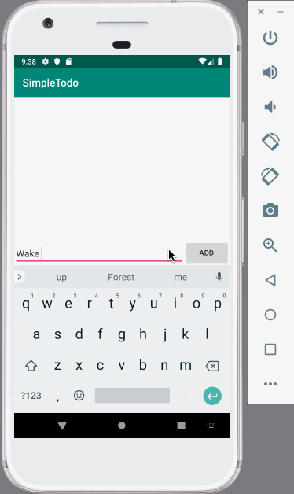
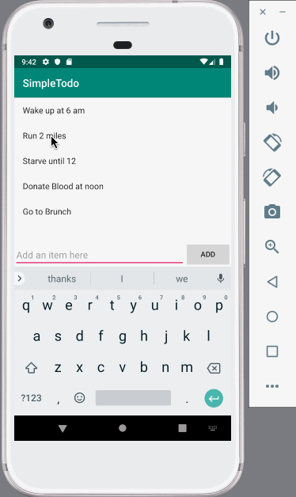
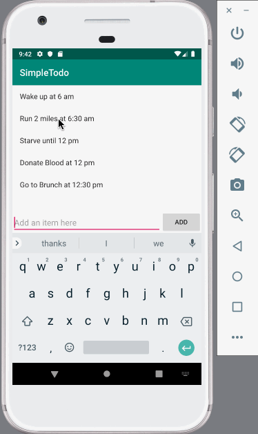

# Project 1 - *Simple Todo*

**Simple ToDo** is an android app that allows building a todo list and basic todo items management functionality including adding new items, editing and deleting an existing item.

Submitted by: **Kevin Lam**

Time spent: **4** hours spent in total

## User Stories

The following **required** functionality is completed:

* [x] User can **view a list of todo items**
* [x] User can **successfully add and remove items** from the todo list
* [x] User's **list of items persisted** upon modification and and retrieved properly on app restart

The following **optional** features are implemented:

* [x] User can **tap a todo item in the list and bring up an edit screen for the todo item** and then have any changes to the text reflected in the todo list

## Video Walkthrough

Here's a walkthrough of implemented user stories:

  
  
  

                                                                             

GIF created with [LiceCap](http://www.cockos.com/licecap/).

